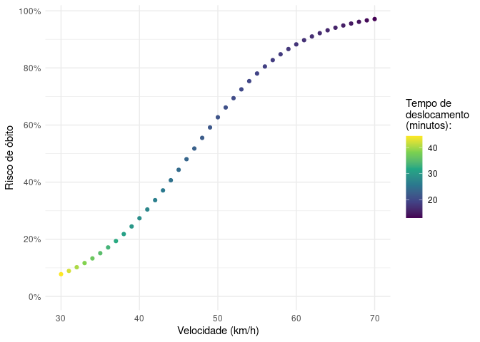

## Setup


```r
library(tidyverse)
library(sf)

options(scipen = 999999)
```

## Importação da amostra

Cada viagem contém trechos de 1 segundo percorrido, com a distância e a velocidade. Assim, é possível calcular a distância e o tempo de deslocamento de cada viagem. 


```r
viagens <- st_read("input", "viagens")
```

```
## Reading layer `viagens' from data source 
##   `/home/pabsantos/Documents/ONSV/velocidade/input' using driver `ESRI Shapefile'
## replacing null geometries with empty geometries
## Simple feature collection with 473334 features and 12 fields (with 1 geometry empty)
## Geometry type: LINESTRING
## Dimension:     XY
## Bounding box:  xmin: -49.38883 ymin: -25.62289 xmax: -49.18951 ymax: -25.37107
## Geodetic CRS:  SIRGAS 2000
```

```r
viagens <- viagens %>% 
  select(id, time_acum, spd_kmh, dist)

st_geometry(viagens) <- NULL

head(viagens)
```

```
##   id time_acum   spd_kmh      dist
## 1 A2        91  3.540548        NA
## 2 A2        92  3.379614 0.9769334
## 3 A2        93  6.115492 0.9769334
## 4 A2        94  9.334172 1.4306720
## 5 A2        95 10.943512 2.2804639
## 6 A2        96 12.713786 2.9650856
```

## Cálculos

Seleção das viagens entre 7,5 km e 12,5 km:


```r
viagens_selecionadas <- viagens %>% 
  group_by(id) %>% 
  summarise(distancia = sum(dist)) %>% 
  filter(distancia >= 7500 & distancia <= 12500) %>% 
  pull(id)

viagens_selecionadas
```

```
##  [1] "A22" "A24" "A5"  "A7"  "B11" "B17" "B9"  "C13" "C15" "C16" "C6"  "D12"
## [13] "D20" "D23" "D28" "D50" "D57" "D8"  "J5"  "J6"  "L11" "L14" "L22" "L28"
## [25] "L7"  "M12" "M14" "M15" "M19" "M23" "M25" "M30" "M32" "M4"  "M5"  "M6" 
## [37] "M7"  "M8"  "M9"  "N3"  "O20" "O28" "O36" "O46" "O48" "O58" "O61" "O72"
## [49] "O80" "O92" "O94" "O95" "W22" "W29" "W40" "W42" "X10" "X13" "X3"  "X7" 
## [61] "Y5"
```

Cálculo da velocidade média por viagem:

A velocidade média ($v_i$) de uma viagem $i$ se deu por uma ponderação das velocidades praticadas em cada viagem. $v_s$ e  $d_s$ representam a velocidade e a distância de cada seção $s$ percorrida, e $d_i$ representa a distância total de cada viagem $i$.

$$v_i = \frac{\sum v_s \times d_s}{d_i}$$


```r
viagens_vel <- viagens %>% 
  filter(id %in% as.vector(viagens_selecionadas)) %>% 
  mutate(tempo = case_when(
         id == lag(id) ~ time_acum - lag(time_acum),
         TRUE ~ 0))

velocidade <- viagens_vel %>%
  drop_na(dist) %>% 
  mutate(vel_ponderada = spd_kmh * dist) %>%
  group_by(id) %>%
  summarise(vel_ponderada = sum(vel_ponderada),
            distancia = sum(dist),
            tempo_min = sum(tempo) / 60) %>%
  mutate(vel_media = vel_ponderada / distancia)

velocidade
```

```
## # A tibble: 61 × 5
##    id    vel_ponderada distancia tempo_min vel_media
##    <chr>         <dbl>     <dbl>     <dbl>     <dbl>
##  1 A22         298188.     8303.      33.3      35.9
##  2 A24         299604.     8343.      30.3      35.9
##  3 A5          506990.    12353.      28.2      41.0
##  4 A7          207225.     7612.      54.3      27.2
##  5 B11         293346.     8741.      39.7      33.6
##  6 B17         414336.    10991.      36.8      37.7
##  7 B9          302079.     8192.      35.4      36.9
##  8 C13         576129.    10454.      21.8      55.1
##  9 C15         372682.    10397.      56.7      35.8
## 10 C16         579458.    11651.      28.1      49.7
## # … with 51 more rows
```

Modelo de regressão linear para inferir o tempo de deslocamento a partir da velocidade média:


```r
vel_reg <- lm(tempo_min ~ poly(vel_media, 3, raw = T), data = velocidade)
summary(vel_reg)
```

```
## 
## Call:
## lm(formula = tempo_min ~ poly(vel_media, 3, raw = T), data = velocidade)
## 
## Residuals:
##      Min       1Q   Median       3Q      Max 
## -15.6136  -4.3939  -0.3514   3.3378  24.8844 
## 
## Coefficients:
##                                 Estimate  Std. Error t value Pr(>|t|)   
## (Intercept)                  191.3200531  69.0785495   2.770  0.00756 **
## poly(vel_media, 3, raw = T)1  -8.3374102   4.4141220  -1.889  0.06401 . 
## poly(vel_media, 3, raw = T)2   0.1385931   0.0917806   1.510  0.13656   
## poly(vel_media, 3, raw = T)3  -0.0007981   0.0006196  -1.288  0.20295   
## ---
## Signif. codes:  0 '***' 0.001 '**' 0.01 '*' 0.05 '.' 0.1 ' ' 1
## 
## Residual standard error: 7.639 on 57 degrees of freedom
## Multiple R-squared:  0.511,	Adjusted R-squared:  0.4853 
## F-statistic: 19.86 on 3 and 57 DF,  p-value: 0.000000006177
```

Prevendo novos valores de tempo de deslocamento a partir do modelo criado:


```r
## Valores entre 30 km/h e 70 km/h
vel_pred <- seq(30, 70, 1)

tempo_var <- predict(vel_reg, newdata = data.frame(vel_media = vel_pred))

resultados <- tibble(velocidade = vel_pred,
                     tempo_min = tempo_var)

resultados
```

```
## # A tibble: 41 × 2
##    velocidade tempo_min
##         <dbl>     <dbl>
##  1         30      44.4
##  2         31      42.3
##  3         32      40.3
##  4         33      38.4
##  5         34      36.7
##  6         35      35.1
##  7         36      33.6
##  8         37      32.1
##  9         38      30.8
## 10         39      29.6
## # … with 31 more rows
```

Relação do risco de morte de um pedestre em caso de colisão com automóvel. Criação de uma regressão logística de acordo com os dados de Ashton (1980):


```r
## Velocidade de impacto
vel_imp <- c(5, 15, 25, 35, 45, 55, 65, 75, 85)

## Chance de morte
chance_obito <- c(0, 0.004, 0.026, 0.139, 0.292, 0.309, 0.156, 0.062, 0.012)

## Chance acumulada
acumulado_obito <- cumsum(chance_obito)

## Uniao em tabela
ash <- tibble(vel_imp = vel_imp,
              chance = acumulado_obito)

## Regressão logística
ash_reg <- glm(chance ~ vel_imp, family = "binomial", data = ash)
summary(ash_reg)
```

```
## 
## Call:
## glm(formula = chance ~ vel_imp, family = "binomial", data = ash)
## 
## Deviance Residuals: 
##      Min        1Q    Median        3Q       Max  
## -0.06324  -0.05816  -0.02519   0.03566   0.07941  
## 
## Coefficients:
##             Estimate Std. Error z value Pr(>|z|)
## (Intercept)  -6.9618     4.9499  -1.406    0.160
## vel_imp       0.1496     0.1031   1.451    0.147
## 
## (Dispersion parameter for binomial family taken to be 1)
## 
##     Null deviance: 8.119654  on 8  degrees of freedom
## Residual deviance: 0.023927  on 7  degrees of freedom
## AIC: 6.2517
## 
## Number of Fisher Scoring iterations: 7
```

Prevendo os valores de risco para velocidades entre 30 km/h e 70 km/h:


```r
obito_var <- predict(ash_reg, newdata = data.frame(vel_imp = vel_pred), type = "response")
```

## Resultados

Unindo todos os resultados:


```r
resultados <- tibble(velocidade = vel_pred,
                     tempo = tempo_var,
                     risco = obito_var)

resultados
```

```
## # A tibble: 41 × 3
##    velocidade tempo  risco
##         <dbl> <dbl>  <dbl>
##  1         30  44.4 0.0778
##  2         31  42.3 0.0892
##  3         32  40.3 0.102 
##  4         33  38.4 0.117 
##  5         34  36.7 0.133 
##  6         35  35.1 0.151 
##  7         36  33.6 0.172 
##  8         37  32.1 0.194 
##  9         38  30.8 0.218 
## 10         39  29.6 0.245 
## # … with 31 more rows
```

Gráfico das variáveis:

<!-- -->

